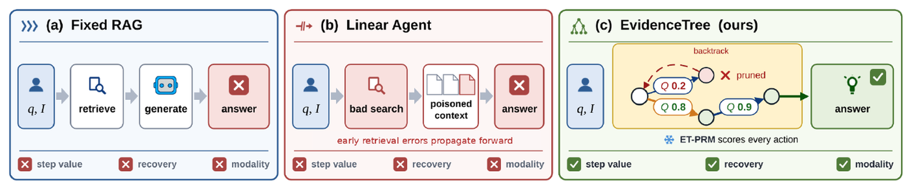
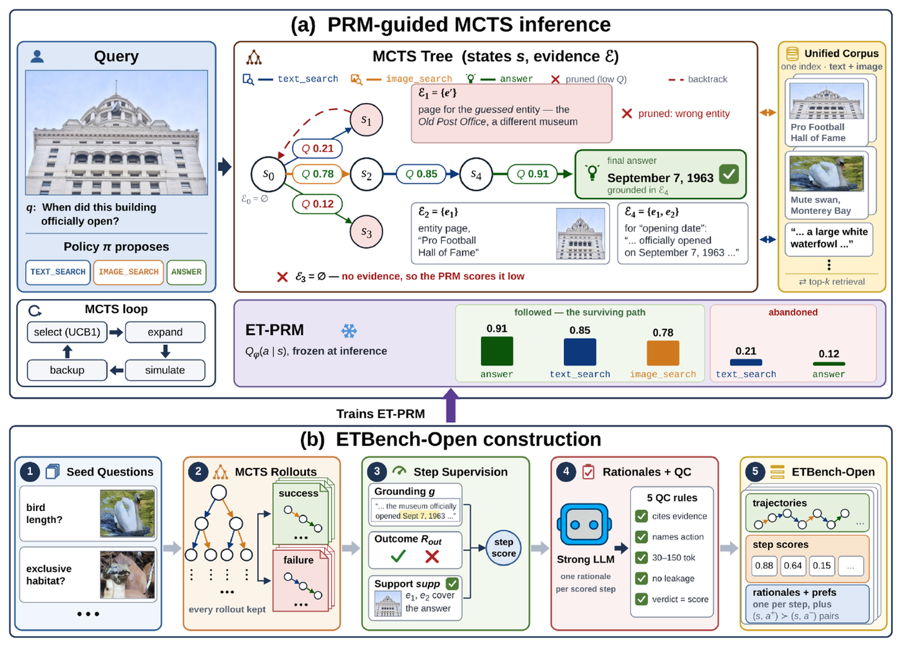

<h1 align="center">EvidenceTree</h1>

<p align="center">
  <b>Process-Rewarded Tree Search over Retrieval Actions for Multimodal RAG</b>
</p>

<p align="center">
  
  
</p>

<p align="center">
  
</p>

Multimodal retrieval-augmented generation is a sequence of retrieval decisions — what to
search, with which modality, and when to stop — yet no current system can tell a good
retrieval action from a bad one. Outcome-only RL misassigns credit across steps,
imitation-learned agents cannot recover from a failed retrieval, and existing process
reward models (PRMs) assume a *fixed* context while every retrieval action *modifies* it.

**EvidenceTree makes retrieval actions the unit of both evaluation and search.** A
grounded, action-typed PRM (ET-PRM) scores each candidate action by what it actually
*retrieved*; Monte Carlo Tree Search over the typed action space
`{text_search, image_search, answer}` uses that score as its sole value signal, so a
branch poisoned by a bad retrieval can be abandoned rather than conditioned on.

## Overview

<p align="center">
  
</p>

**(a) Inference.** The search tree lives in the retrieval action space: nodes are evidence
states, edges are typed retrieval actions executed against a benchmark-provided corpus, and
the frozen ET-PRM scores every candidate edge for UCB1 selection. **(b) Training data.**
MCTS rollouts are labeled per step with a dual-source reward and an answer-support gate,
paired with QC-filtered rationales, and distilled into ET-PRM.

Four components:

- **ET-PRM.** Step labels fuse *local grounding* (relevance of what the action retrieved,
  scored in one CLIP space so text- and image-side evidence are comparable) with
  *tree-level outcome credit* (the Monte Carlo success rate of all rollouts through the
  node). An **answer-support gate** denies full credit to correct-but-unsupported answers,
  so parametric lucky guesses cannot masquerade as good retrieval.
- **MCTS over retrieval actions.** Standard UCB1 with the PRM's Q as the only quality
  signal — no novelty or modality-coverage bonus. Because the tree branches over *actions*,
  backtracking out of a failed retrieval is a first-class operation.
- **A unified cross-modal action space.** Corpus text chunks and images are independent
  units in one normalized CLIP index; both search actions query it and return mixed
  top-*k* results tagged with their modality, so the disambiguate-then-look-up chain
  (`image_search` names the entity, `text_search` fetches its attribute) is two edges of
  the same tree.
- **ETBench-Open.** A step-level annotated dataset of multimodal retrieval trajectories,
  built entirely on benchmark-provided corpora — no live web APIs — under a five-rule,
  leakage-proof rationale protocol.

## Results

Overall accuracy (%), means over three seeds. All three rows share one backbone and this
repository's corpus protocol, isolating the gain from tree search and the PRM: Vanilla RAG
is the fixed-pipeline control, and Best-of-*N* is the matched-budget reranking control. The
paper additionally compares against published baselines and reports ablations and PRM
diagnostics.

| Method (backbone Qwen2.5-VL-7B)  | InfoSeek       | ScienceQA      | GQA            |
| -------------------------------- | -------------- | -------------- | -------------- |
| Vanilla RAG                      | 36.3 ± 0.5     | 89.0 ± 0.3     | 62.4 ± 0.3     |
| VisualPRM-8B + Best-of-*N*       | 41.3 ± 0.5     | 92.4 ± 0.3     | 62.8 ± 0.3     |
| **EvidenceTree (ours)**          | **46.8 ± 0.4** | **94.6 ± 0.2** | **64.7 ± 0.3** |

## Installation

```bash
git clone https://github.com/Celveen/EvidenceTree.git
cd EvidenceTree
python -m venv .venv && source .venv/bin/activate     # or conda create -n evidencetree python=3.11

pip install -r requirements/base.txt                  # pure-Python core: BM25, metrics, API clients
pip install -e .
```

Two heavier dependency tiers are optional:

| File                       | Contents                                | When you need it                     |
| -------------------------- | --------------------------------------- | ------------------------------------ |
| `requirements/base.txt`    | core Python deps                        | always; enough for every mock run    |
| `requirements/models.txt`  | torch, transformers, sentence-transformers, faiss | real CLIP retrieval, VisualPRM scoring |
| `requirements/server.txt`  | vLLM, peft, trl, wandb                  | serving the policy VLM, PRM training |

## Quickstart

Every command below runs offline on CPU — no API keys, no model downloads.

```bash
pytest                                                        # unit + integration tests

python scripts/demo_5vqa.py                                   # 5-sample end-to-end VQA demo
python scripts/demo_5vqa.py --proposer llm --scorer visualprm # same, exercising the VLM + PRM code paths

python scripts/run_inference.py --config configs/mcts.yaml --mock   # MCTS inference on mock data
python DatasetConstruct/run_pipeline.py --mock                      # 4-step dataset pipeline
```

`demo_5vqa.py` runs the real searcher over a tiny image-bearing world with deterministic
stand-in encoders, printing every rollout with its retrieved units and node statistics:

```text
QUERY vqa_0: Which city is linked to the red circle in this image?
  rollout t=0  reward=1.000  answer='Paris'
      step 0: text_search('Which city is linked to the red circle in this image?')
        [text]  doc_0   score=+0.717  The red circle emblem is kept in Paris.
      step 1: image_search(<state image>, region=None)
        [image] doc_0   score=+1.000  red circle
      step 2: answer('Paris')
  TREE (visits, mean Q):
    - text_search('city linked red circle this image')   N=5  Q=1.000
      - image_search(<state image>, region=None)         N=2  Q=1.000
    - image_search(<state image>, region=None)           N=1  Q=0.200
```

## Repository layout

```
src/evidencetree/
├── actions/      typed action space, executor, retrievers (unified CLIP index + BM25)
├── mcts/         search loop, nodes, UCB1, action proposers (policy VLM / heuristic)
├── prm/          PRM scorer, grounding + answer-support verifiers, step labeling, rationale QC
├── pipeline/     build_search_stack — the single shared assembly for construction and inference
├── eval/         benchmark loaders and metrics
├── generation/   pluggable generation backends (mock / HuggingFace / OpenAI-compatible API)
└── utils/        config, logging, image regions
DatasetConstruct/ ETBench-Open construction pipeline (4 steps) + benchmark data preparation
scripts/          inference, index building, the 5-sample demo
configs/          search / retrieval / policy / PRM configuration
tests/            unit and integration tests
```

Construction and inference share **one** assembly function,
[`build_search_stack`](src/evidencetree/pipeline/assembly.py) — retrievers, executor, policy
proposer, action gate, and scorer are wired in exactly one place, so the trees that produce
training data and the trees searched at inference cannot drift apart.

## Reproducing the experiments

### 1. Prepare benchmark corpora

Each benchmark is converted to a shared `queries.jsonl` / `corpus.jsonl` layout under
`data/corpus/<benchmark>/`:

```bash
python DatasetConstruct/prepare_infoseek.py --raw-dir data/corpus/infoseek/raw
python DatasetConstruct/prepare_gqa_30k.py --n 30000
python DatasetConstruct/prepare_other_datasets.py --dataset scienceqa
```

See [`DatasetConstruct/README.md`](DatasetConstruct/README.md) for image acquisition and
corpus construction details.

### 2. Build ETBench-Open

```bash
cp DatasetConstruct/.env.example DatasetConstruct/.env    # then fill in the API keys it lists
DatasetConstruct/start_qwen25vl.sh                        # serve the policy VLM (OpenAI-compatible)

python DatasetConstruct/run_pipeline.py --n 100           # always pilot a small run first
python DatasetConstruct/run_pipeline.py                   # full build

python DatasetConstruct/validate_dataset.py data/etbench_open/train.jsonl data/etbench_open/val.jsonl
```

The four steps — MCTS rollouts, step scoring, rationale generation, quality filtering — can
be run individually and resume from partial output. The record format is specified in
[`DatasetConstruct/SCHEMA.md`](DatasetConstruct/SCHEMA.md).

### 3. Fine-tune ET-PRM

ET-PRM is initialized from VisualPRM-8B and trained in three stages on ETBench-Open:
generative SFT on (state, action, rationale, score), action-typed DPO on same-state
contrastive pairs mined from the search trees, and temperature/Platt calibration of the
score logit. Training is driven from the exported dataset with a standard LoRA SFT/DPO
stack; the repository provides the dataset export, the preference pairs, and the
inference-side scorer interface.

### 4. Run PRM-guided inference

```bash
python scripts/run_inference.py --config configs/mcts.yaml \
    --set prm.scorer=visualprm \
    --set prm.model_name=/path/to/et-prm \
    --set retriever.backend=unified
```

At inference the rationale is skipped entirely — only the score token's logit is read — so
search pays no generation latency.

## Configuration

`configs/mcts.yaml` (inference) and `DatasetConstruct/config.yaml` (construction) share the
same block structure. The knobs that matter:

| Key                                  | Default   | Meaning                                                        |
| ------------------------------------ | --------- | -------------------------------------------------------------- |
| `search.rollouts` / `mcts.rollouts`  | 10        | rollout budget *P* per question                                 |
| `search.max_depth`                   | 3         | maximum actions per trajectory (the root is depth 0)            |
| `search.top_k_children`              | 3         | candidate actions kept per expansion                            |
| `search.c_uct`                       | 1.0       | UCB1 exploration constant                                       |
| `search.early_stop_q`                | 2.0       | stop when a rollout exceeds this reward; > 1 disables early stop |
| `retriever.backend`                  | `unified` | `unified` (one CLIP space) \| `bm25` \| `hybrid`                |
| `retriever.dedupe`                   | `entity`  | collapse near-duplicate units before top-*k* truncation         |
| `retriever.image_search`             | `true`    | allow image-query retrieval; auto-disabled when queries lack images |
| `prm.scorer`                         | —         | `visualprm` (real / fine-tuned) \| `overlap` (offline heuristic) |
| `verifier.support.floor`             | 0.3       | credit for a correct but evidence-unsupported answer             |
| `action_gate.enabled`                | `false`   | optionally restrict action types per benchmark                   |

## License

Apache License 2.0 — see [LICENSE](LICENSE).

## Citation

```bibtex
@misc{evidencetree2026,
  title = {EvidenceTree: Process-Rewarded Tree Search over Retrieval Actions
           for Multimodal RAG},
  year  = {2026},
  note  = {Under review}
}
```
